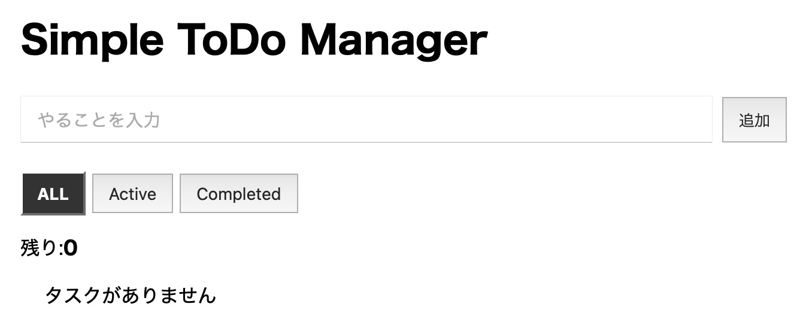
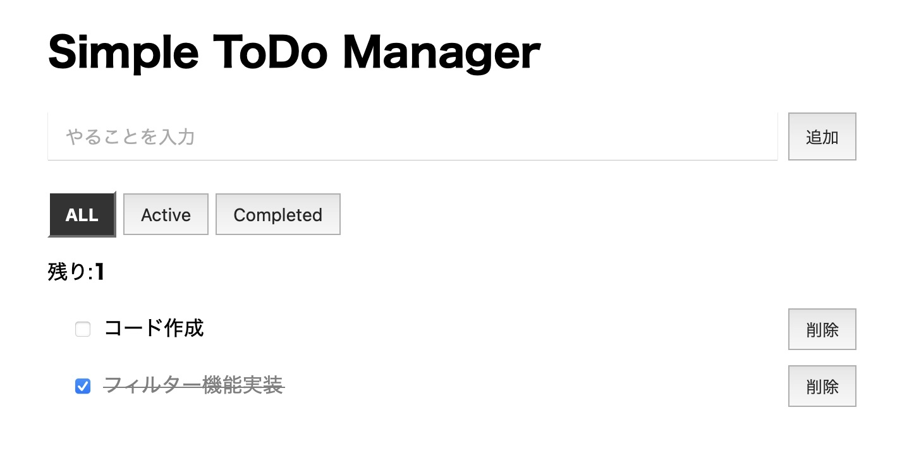
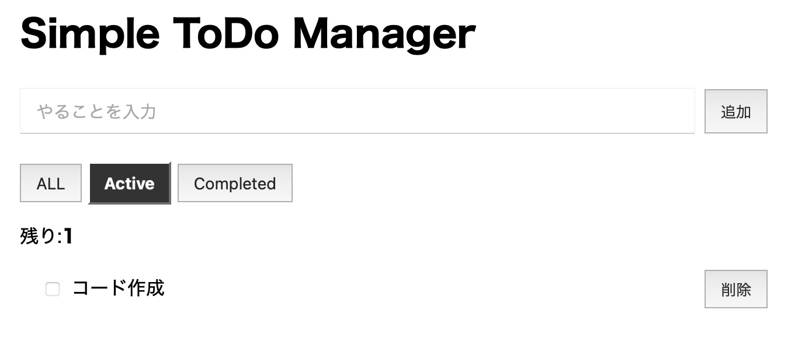
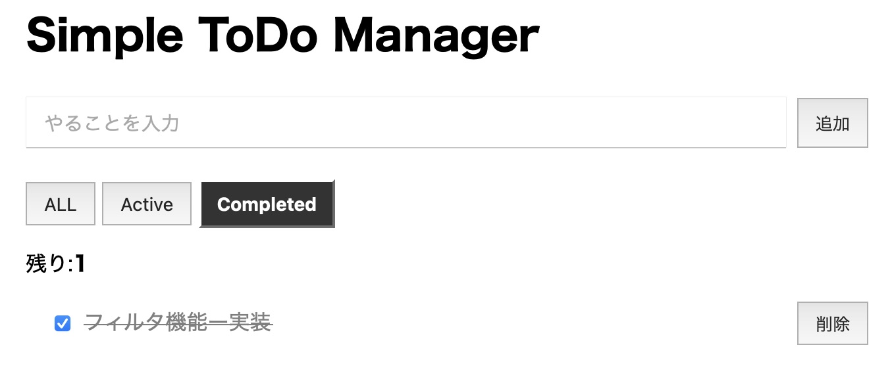

# Simple ToDo Manager

シンプルなUIで直感的にタスク管理ができるToDoアプリです。  
タスクの追加・完了管理・削除・フィルタ機能を実装しています。

---

## Author

岡本　光冬（オカモト　アルト/GitHub:aruto-nick）

---

## アプリ画面スクリーンショット

---

## 🔗 デモ
https://aruto-nick.github.io/simple-todo-manager/

---

## 📌 概要

日々のタスク管理を目的としたシンプルなToDoアプリです。  
JavaScriptの基礎理解（配列操作・DOM操作・状態管理）を目的として作成しました。

---

## 🛠 使用技術

- HTML
- CSS
- JavaScript（Vanilla JS）
- localStorage

---

## ✨ 主な機能

- タスクの追加
- タスクの完了 / 未完了の切り替え
- タスクの削除
- フィルタ機能
  - ALL（すべて）
  - Active（未完了）
  - Completed（完了）
- タスクの保存（localStorage）
- ページ更新後のデータ保持

---

## 💡 工夫した点

### ① render関数によるUI更新の分離

function render() {
  renderList();
  renderCount();
  renderFilter();
}
UI更新処理を分割することで、役割ごとに整理し、可読性と保守性を向上させました。

### ② フィルタ機能の状態管理

if (currentFilter === "active") {
  filteredTodos = todos.filter(todo => !todo.completed);
}
状態（currentFilter）によって表示内容を切り替えることで、シンプルな状態管理を実現しました。

### ③ localStorageによるデータ保持

localStorage.setItem("todos", JSON.stringify(todos));
ブラウザのストレージを利用し、ページ更新後もタスクが保持されるようにしました。

---

## 学んだこと

DOM操作の基本
配列操作（filterなど）
状態管理の考え方
UIとロジックの分離
データの永続化（localStorage）

---

## 今後の改善点

タスク編集機能の追加
UIデザインの改善
CSSクラスによるスタイル管理の最適化
日付表示機能の追加